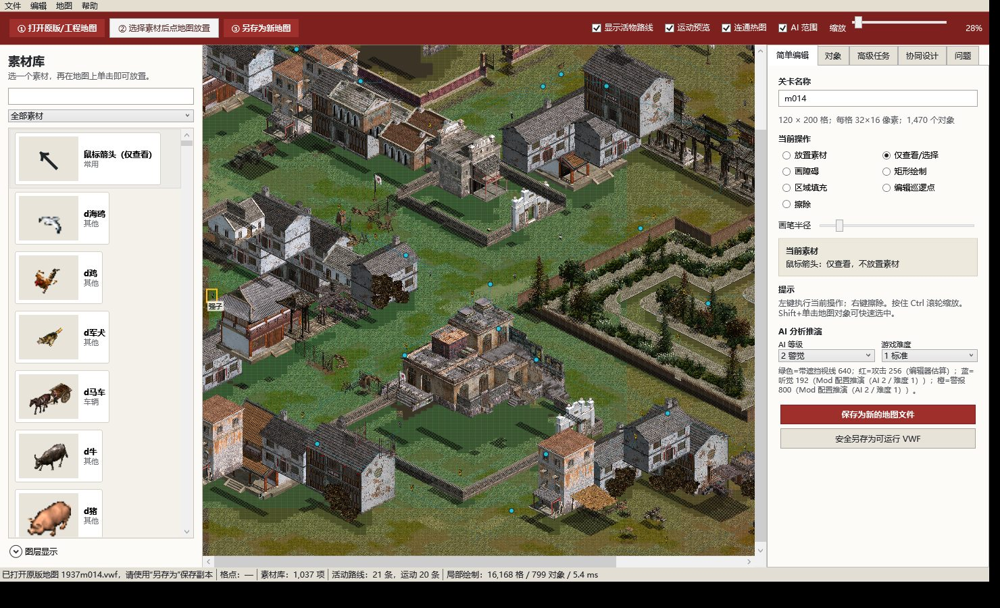
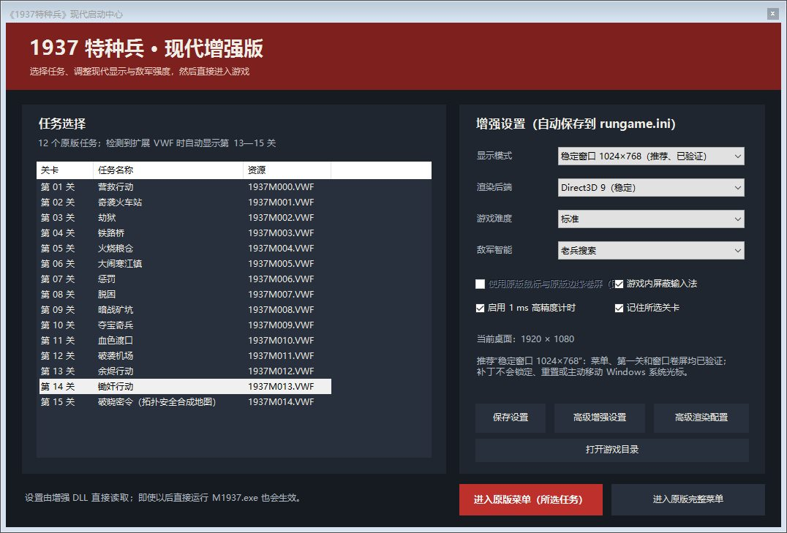
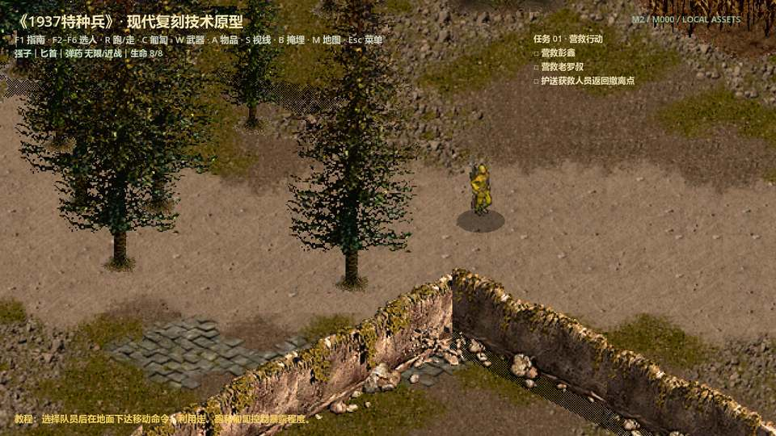
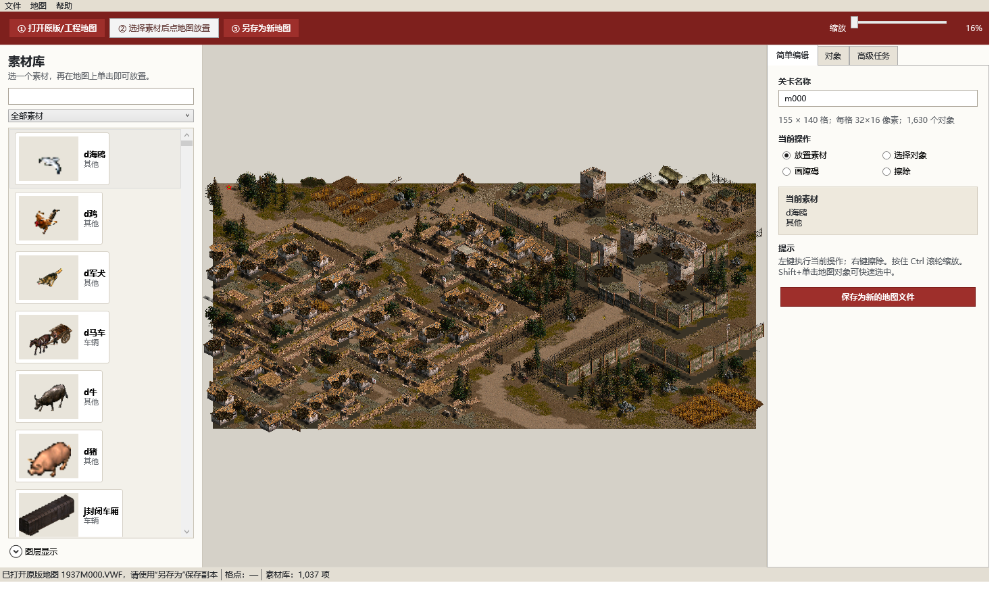
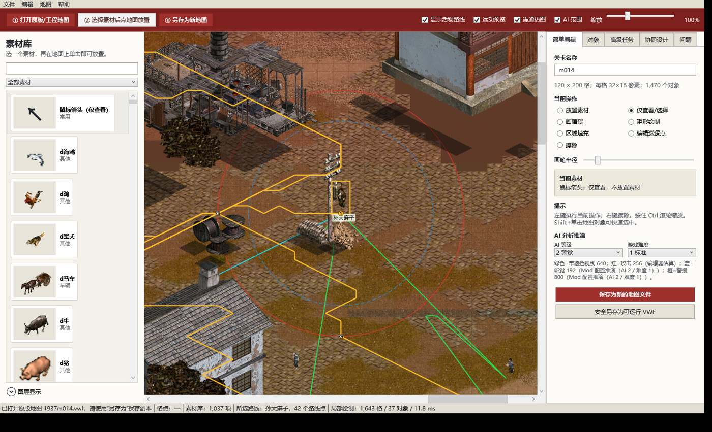
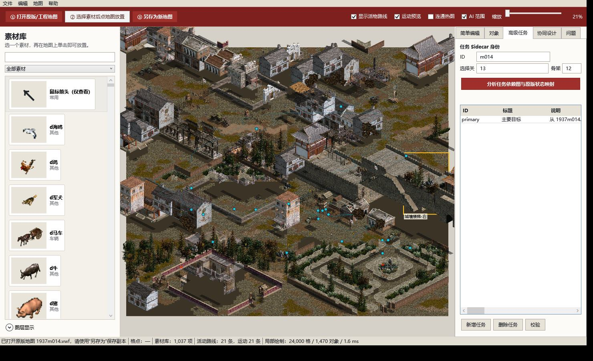

# 《1937特种兵：敌后武工队》现代兼容与社区开发项目

本仓库同时维护稳定原版 MOD 与现代完全复刻工程，包含四个相互协作的
子项目：

| 目录 | 内容 |
|---|---|
| [`Mod/`](Mod/) | 完整可运行的现代增强版，含 12 个原版关卡和全部运行资源 |
| [`Patch/`](Patch/) | 可叠加到已安装原版上的轻量补丁、源码、分析和发行包 |
| [`MapEditor/`](MapEditor/) | 现代地图与任务编辑器，可导入原版 VWF |
| [`SDK/`](SDK/) | 已验证 EXE 的地址、结构、补丁原语和运行时访问接口 |
| [`Remake/`](Remake/) | 正在继续开发的 Godot 现代复刻工程，以稳定 MOD 为行为基准 |

## 项目效果一览

| MapEditor：原版地图、活动路线与任务分析 | Mod：现代启动中心 |
|---|---|
| [](Screenshots/MapEditor-module-overview.jpg) | [](Screenshots/ModernLauncher-final.png) |
| **Patch：12 关现代启动中心** | **Remake：Godot 现代复刻工程** |
| [](Screenshots/Patch-modern-launcher.jpg) | [](Screenshots/Remake-runtime-prototype.jpg) |

以上均为本机实际程序窗口截图；图片已在本地完成 OCR 检查和 JPEG 压缩，
没有提交完整桌面或未压缩原图。

## 直接玩增强版

本仓库的完整资源由 Git LFS 管理：

```powershell
git lfs install
git clone https://github.com/bigsinger/1937tezhongbing.git
cd .\1937tezhongbing\Mod
.\选择关卡.ps1
```

也可以双击 `Mod\启动游戏-窗口模式.cmd`。现代启动中心可直接选择任意
一个原版关卡，并持久化难度、敌军 AI、显示、渲染、卷屏、输入法屏蔽
和计时设置。

增强版的主要改进：

- cnc-ddraw 将旧 DirectDraw 转换为 Direct3D 9/OpenGL；
- 修复启动弹框、长时间未响应、输入消息阻塞和代理 DLL 递归加载；
- 默认使用已重复验证的 1024×768 稳定窗口；专用 DirectInput 映射让
  原版游戏光标跟随 Windows 光标，但不会锁定、回中或移动系统光标；
- 菜单、第一关点击及窗口边缘卷屏均已通过真实鼠标消息回归测试；
- 发布门禁拒绝光标移动/裁剪/捕获 API；菜单和场景额外完成 1,914 个
  只读裁剪采样，限制样本为 0；
- 60 FPS、VSync、高精度计时和原版边缘卷屏；
- 游戏窗口禁用 IME，支持现代 DPI；
- 通过难度/AI 等级扩展敌军听觉和警报协同；
- 有界“最后目击点”AI：反应延迟、1—4 人增援、前向截击、2—4 点搜索、
  重获目标与超时返回原版巡逻，不持续读取视线外玩家坐标；
- 可关闭的按键别名、结构化诊断和分通道性能遥测；
- 可选任务 sidecar 和 x64 原生插件 ABI；默认关闭，失败完整回退原版；
- 全部 12 个原版关卡都可直接选择，不改写原 EXE、不伪造存档；
- 12 关继续使用原版“新游戏 → 任务简报 → 点击/Enter 继续 → 地图”的
  界面与交互流程；没有额外弹窗，只把原简报图片内容替换为文字排版图；
- 原版 12 个 `Intro_*.psd` 资源在原索引原位替换；修改
  `Mod/关卡名称.json` 后运行
  `Patch/tools/Update-TextBriefings.ps1` 即可安全重建 GFL；
- 兼容全屏保留底栏、F1 帮助、M 小地图和全部原版热键，可选择保持
  比例或无黑边铺满；
- 设置保存在原版 `rungame.ini` 新增的 `[mod]` 段。

关卡数量审计见 [`doc/关卡数量与VWF审计.md`](doc/关卡数量与VWF审计.md)，
十二关故事见 [`doc/十二关故事.md`](doc/十二关故事.md)。
后续制作统一遵循
[`doc/关卡制作与验证方法论.md`](doc/关卡制作与验证方法论.md)；MOD 与
编辑器的分级改进清单见
[`doc/MOD与MapEditor持续改进评估.md`](doc/MOD与MapEditor持续改进评估.md)，
全部建议的最终实现与证据见
[`doc/MOD与MapEditor持续改进实施报告.md`](doc/MOD与MapEditor持续改进实施报告.md)；


## 运行与开发 Remake

`Remake` 现在直接以仓库稳定 `Mod/` 为唯一产品内容基线。生成最新版本：

```powershell
cd .\Remake
.\tools\Build-Playable.cmd
```

脚本会在需要时自动从 `Mod/` 转换 1,394 项资源和十二关内容，生成入口：

```text
Remake\LocalBuild\1937Remake\Play-1937-Remake.cmd
```

完全复刻不是“关卡能显示”就算完成。功能差距、证据规则、逐关通关矩阵和
发布硬门禁见
[`Remake/docs/MOD完全复刻开发实施方案.md`](Remake/docs/MOD完全复刻开发实施方案.md)；
机器可读状态位于
[`Remake/game/data/mod_parity_contract.json`](Remake/game/data/mod_parity_contract.json)。
第一关无遮挡移动与树边绕行已建立 MOD/Remake 共用运行轨迹和严格差分
回归；schema、基线、比较器与当前证据见
[`Remake/docs/MOD完全复刻开发实施方案.md`](Remake/docs/MOD完全复刻开发实施方案.md#8-已落地的首条-modremake-差分闭环)。
Remake 还已通过十二关双轮 600 秒真实窗口性能门禁：33,125 帧整体
P95 18.389 ms、P99 20.714 ms、零个 >50 ms 帧，且不会控制系统鼠标。
参考硬件与逐关数据见
[`Remake/validation/baselines/remake/campaign-performance-1920x1080-v1.json`](Remake/validation/baselines/remake/campaign-performance-1920x1080-v1.json)。
十二关后续运行态取证、共用路线/静止计数器、追击关系、80° 环境粒子场和
对应性能优化见
[`Remake/docs/CRT_RUNTIME_STATE_BASELINE.md`](Remake/docs/CRT_RUNTIME_STATE_BASELINE.md)。

## 地图编辑器

`MapEditor` 是 .NET 10 WPF 程序，支持：

- 直接打开原版 VWF，以完整地形和原版对象进行预览、编辑、另存；
- 读取 VWF 内真实巡逻路线，并结合移动障碍层还原八方向寻路轨迹；默认
  显示全部活动路线和低开销运动预览，选中活物后高亮完整轨迹、路线点
  顺序和当前位置；
- 内置 1,037 项相对路径素材，包括角色、树木、院墙、房屋、门、
  障碍物、车辆、物品、地表图块和 12 张原版关卡整图；
- 高对比浅色界面，默认使用“打开地图→选择素材→另存”三步流程；
- 素材库第一项为默认“鼠标箭头（仅查看）”，浏览时不会误放置对象；
- 地表、视线障碍、移动障碍、事件、人工通行修正五层编辑；
- 敌军、玩家、门、物品和任务点放置；
- 高级任务页直接编辑 Sidecar 身份、关卡路由、依赖、可选/失败目标、
  数据库对象绑定、区域和期限，不需要手写任务 JSON；
- 任务触发器、目标引用、数量、失败条件和任务链；
- 安全原生 VWF 另存、二进制/语义差异、原子替换和备份；
- Undo/Redo、多选/框选/对齐/分布、地形画笔/矩形/填充、巡逻点编辑、
  对象筛选、图层锁定/透明度/独显/预设和自动保存恢复；
- 任务依赖图、AI 协同和玩家时间轴，跨地图区域库、语义三方合并及
  正式 `.m1937mission.json` 插件往返；
- 1,037 项素材放置元数据与一键 README/缩略图/故事/验证摘要发布；
- 原版 `VWL1/SLIST1` VWF 只读导入；
- 可进行 Git 差异比较的 `*.m37map.json` 和任务包导出。

运行已发布版本：

```powershell
.\MapEditor\启动地图编辑器.ps1
```








开发构建：

```powershell
dotnet build .\MapEditor\MapEditor.slnx -c Release
dotnet run --project .\MapEditor\MapEditor.Tests\MapEditor.Tests.csproj -c Release
```

## M1937SDK

[`SDK/`](SDK/) 以只读模块视图和强校验补丁原语固定已分析出的 EXE 身份、
RVA、VWF 场景布局及运行时全局变量。补丁只能在 PE 元数据和哨兵指令均
匹配时写入内存；`Patch/src/dinput-proxy` 已直接引用 SDK，不再重复维护
裸地址。

```powershell
.\SDK\build.cmd
```

地址表同时保存在 [`SDK/address-catalog.json`](SDK/address-catalog.json)，
便于后续插件、分析工具和文档共用同一份确定性依据。
任务 sidecar schema、事件 ABI、原子状态和原生插件开发见
[`SDK/docs/任务Sidecar与原生插件开发指南.md`](SDK/docs/任务Sidecar与原生插件开发指南.md)。

## 轻量补丁

如果已有自己的原版目录，可使用 `Patch/release` 中的发行包。补丁安装器
会校验 `M1937.exe` 的 SHA-256，只对已验证版本安装。完整排查与实现说明
见 [`Patch/docs/1937特种兵-Win10-Win11兼容性排查与解决方案.md`](Patch/docs/1937特种兵-Win10-Win11兼容性排查与解决方案.md)。

## 原版 Mod 开发

后续原版魔改统一在 `Mod/` 维护。修改代理或现代启动中心后，执行：

```powershell
powershell -NoProfile -ExecutionPolicy Bypass -File .\Patch\tools\Build-Mod.ps1
```

脚本会以 x86 Release 参数重新编译 `dinput.dll`，并把 DLL 和
启动中心同步到 `Mod/`；源码构建与可玩成品不会再出现版本脱节。需要同时
重建轻量补丁发行包时执行 `Patch\tools\Build-Release.ps1`，该脚本也会
先自动更新 `Mod/`。

## 验证

- DirectInput 代理使用 Visual C++ x86 `/W4 /O2 /Brepro` 可重复构建；
- 1024×768 原版 UI 画布经现代桌面缩放后通过响应探针，底栏、F1、M 等界面资源不再因宽屏内部画布丢失；
- 第一关 VWF 导入验证为 155×140 网格、5 个图层、1,630 个对象；
- MapEditor Release 构建为 0 警告、0 错误，JSON 往返测试通过；
- 12 关隔离回归覆盖启动、F1、M、鼠标、AI、存读档和任务转换；未响应、
  光标裁剪限制以及系统
  鼠标/输入/焦点调用均为 0；
- 最新 12 关 × 16 阶段隔离回归共通过 192/192 个阶段；AI 搜索 38 次、
  路径重规划 128 次、脱离成功 35/35，最大 tick 为 1,325 μs，且警报后
  不采样视线外玩家的实时位置；
- 菜单、小/中/大地图各 10 分钟共 38,739 个样本，P99 为
  9.414—12.837ms，未响应和超过 50ms 卡顿均为 0；
- m000—m011 原生 VWF 无修改逐字节往返和损坏输入拒绝通过；
- 原版源目录只作只读取证，后续开发均在 `Mod/`。
