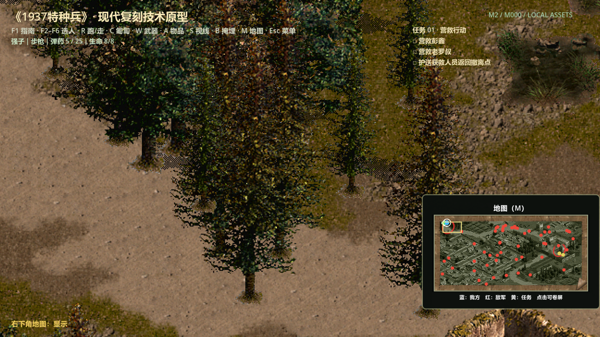
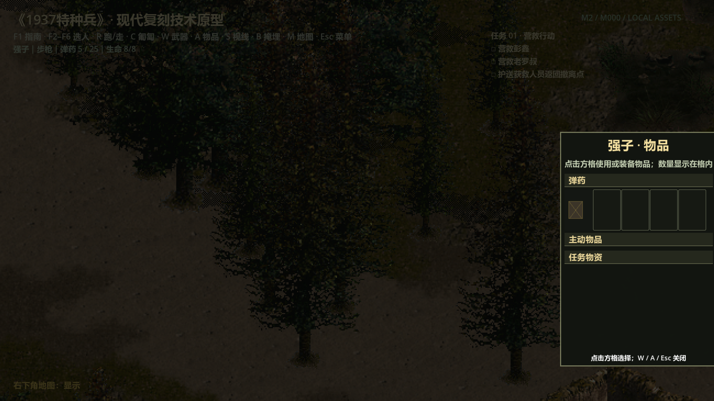
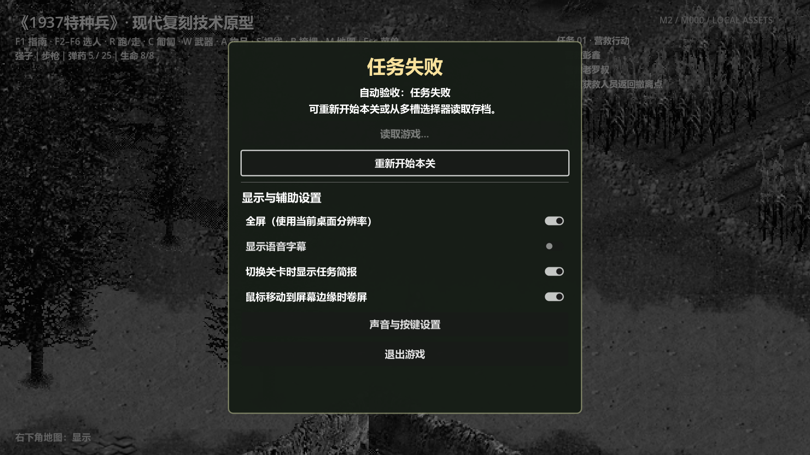

# 《1937特种兵》复刻工程

## 效果截图

最新本地试玩包请运行 `LocalBuild/1937Remake/Play-1937-Remake.cmd`。








这是一个从零实现的新游戏工程。游戏运行时使用 Godot 4.7.1 Standard 与
typed GDScript，旧资源研究和本地转换工具使用 .NET 10。仓库中的稳定
`Mod/` 是当前唯一产品内容基线；完全复刻的完成标准和实施顺序见
[稳定 MOD 完全复刻开发实施方案](docs/MOD完全复刻开发实施方案.md)。

## 里程碑状态

| 层次 | 当前成果 | 尚未完成 |
|---|---|---|
| 资源格式 | 1394 个 GFL 条目；IBLOCK、TLG1、SPR1、DBL、VWF、SLIST1、SLF/WAV；L1—L5、阵营、感知、生命值、攻击和巡逻字段 | 与后续玩法相关的剩余 DBL/SLIST 扩展字段 |
| 精灵动画 | 980 个精灵、2,775 个动画组、11,898 帧全部转换；20 动作 × 9 方向语义；772 名运行时角色已绑定 39 个原 SPR 的 212 套动作、1,664 组和 9,896 帧，并逐方向核对 serial、三组 triplet、锚点、帧时序；secondary 第 0/2 分量已驱动原版 60 Hz 分量移动；2,775 组 FirstLookup/SecondLookup 已分别按原版接入 L3 移动足印与 L2 视线足印，并随动作和朝向原子替换；204 套八方向动作及 8 套原生四方向车辆动作均可加载；玩家出生朝向读取 VWF，跑/走切换不闪站立帧；AI 按原计数中间三分之一播放 30 套 `stand_action`（240 方向、1,912 帧）并保存相位，attack type 8/10 使用原 `active_action`；攻击末帧命中与死亡末帧保持；GFL 270/272 换装与 GFL 470/900 特殊对象帧接线 | secondary 中间分量的非二维消费者、RowLookup 逐列像素遮挡校准 |
| 关卡 | `m000`—`m011` 全部生成地形、19,199 个实体和 L2/L3 数据；玩家/敌人/护送角色动态占位；十类拾取物已按 DBL `header[2]`、原容器/mode、单件数量、精灵点击框和 32×16 邻格完成规则恢复，汽油桶保持场景爆炸物 | 其余非角色实体精确足印和通用中立角色行为 |
| 任务 | 十二关任务图、scene 白名单、依赖/去重/限时/胜负与世界事件协议；逐关 DBL 998 爆破策略；十二关稳定 MOD 规则真实资源世界动作胜利闭环、逐关中途存读档和必要角色/护送者死亡失败门禁；m006/m008/m009/m011 稳定 MOD/修复增强双规则；十二关 43 个导演节点、45 行补写对白、教程、镜头请求、AI 协作与难度第一版 | 与稳定 MOD 对照的真人完整通关轨迹、原版逐字对白/镜头证据升级及节奏和平衡校准 |
| 玩法 | A*、空间索引动态占位、稀疏图实时动态规划与密集图按解析终点连续预热的巡逻路径/后缀/静态失败复用、门增量导航、实际战斗；四渲染队列；右侧五列背包；6/7/9 投射物；type 8/10 的 actor 62 精确伤害/几何/警报/五轮效果粒子与 type 11 注意力保持；S 的方向/L2 遮挡空心扇形、type 90/GFL 341 唯一观察标记与 B 的 type 78/GFL 64 藏尸/双容器/101 tick 闭环；实时右下角地图；启动页/菜单内十二关原生自由选择；十槽原子存档、schema 0→1 迁移与未来版本只读保护、十二关胜利进度磁盘闭环、按键重映射、分通道音量、失败重玩；原 WAV/简报、确定性事件回放和十二关双轮十分钟窗口性能门禁 | 原版 SAV/SI 战役格式差分、完整全局随机调用顺序、完整过场、稳定 MOD/Remake 真人完整输入通关差分和 Windows 11/更多硬件跨机器验证 |

“资源和任务结构已恢复”不等于“游戏已经复刻完成”。目前已经是带真实碰撞、寻路、动态角色、实际战斗、右下角实时地图、五列背包、特殊对象、完整局内存读档和通用任务事件的十二关可玩原型。`real_mission_world_loop_test.gd` 会逐关加载真实 MOD 资产，通过产品世界入口执行营救、拾取、击杀、任务掉落、炸药消耗、爆破、四区占领和撤离；十二关初始状态和每个稳定 MOD 必需目标完成点都会写入真实磁盘，再逐份重建整张关卡并校验规范化状态哈希，同时按关卡验证必要队员或护送者战斗死亡和三关超时。它还分别验证 m006/m008/m009/m011 的稳定 MOD 与修复增强闭环；矿坑提前引爆失败只属于 m008 修复规则。`real_input_world_test.gd` 验证第一关的 F2、鼠标左键、M 和 E；`real_input_campaign_journey_test.gd` 再以 648 个仅限目标视口的事件逐关覆盖角色定位、移动、R/C、W/A、M、F1、Esc、S、普通攻击、B 掩埋、物理快速存读、主要失败和键盘重玩。两者都不移动、锁定或裁剪系统鼠标。`campaign_performance_probe.gd` 进一步在真实 1920×1080 窗口中双轮运行十二关；参考基线的 33,125 帧整体 P95 18.389 ms、P99 20.714 ms、零个 >50 ms。上述门禁不再靠直接注入“目标完成事件”，但仍是确定性自动操作，不等于稳定 MOD/Remake 两边的真人完整通关录像。十二关导演和难度已有可执行第一版，其中补写对白、镜头时长、教程文本、AI 策略和数值明确标为 `remake_editorial`，不能冒充原版内容。

## 动画与任务恢复结论

SPR 动画组参数 0 已确认使用：

```text
serial_id = action_index * 9 + direction_index
```

共 20 个动作槽和 9 个方向槽，其中方向 0 为“无”，1—8 为八方向。转换器保留每组全部帧、原始顺序、锚点参数、单组横向 atlas 和逐帧 PNG，并按原版 `parameters[2] + 1` 保存和播放每帧保持 tick。玩家和敌人的移动/站立、对应武器攻击及死亡动画已经接线；AI 静止时按 `sub_4587E0/sub_458A80` 的计数规则，在周期中间三分之一切换到 `stand_action`，其余时间显示 `stand`，动作相位可随局内存档恢复。attack type 8/10 使用原 `active_action` serial。攻击进入最后一帧时复核射程/视线，类型 1—5 结算即时命中，类型 6/7/9 生成世界投射物后再结算，死亡播放一次并保持末帧。type 8 现在具有 faction 1 目标进入 32×16 椭圆后触发的 actor 84 / GFL 470 世界对象；type 10 是第 100 个 world tick 触发的 actor 85 / GFL 900 延时对象；二者共用 actor 62 的 128 主伤害、128×64 椭圆、两组特殊对象伤害带和 800 警报。效果 11/15 按原 MSVCRT LCG 尝试 1—2 个 64×32 散布粒子，使用首匹配 GFL 动画播放五轮，实际寿命为 90/150 world tick。type 11 建立以来源位置为锚点、在来源移动或目标进入战斗转换时释放并可存读档的注意力保持状态。物品 99 已恢复为古明穿日军军服后自动取得：第 101 个角色 tick 从 type 10/GFL 270 切到 type 91/GFL 272、军服 54 换成青衫 92，并按目击与特殊识破规则暴露/恢复伪装；脱装完整逆转。`sub_458700` 已证明非致命伤只扣生命，不写动作、命令或硬直计时，因此复刻也不再插入闪红/硬直。

SPR 三组 triplet 的真实文件顺序现已修正为 primary、tertiary、secondary；
`sprite.json` schema 3 直接使用运行时语义，旧 schema 1/2 由加载器显式迁移。
secondary 第 0/2 分量分别是原版每个 60 Hz actor tick 的 X/Y 位移上限：
常见走/匍匐为 2/1 像素，跑步为三倍 6/3 像素。移动只在本 tick 处理一个
网格路径点，不把剩余时间带入下一段；恰好到点则同 tick 推进路径游标，不会
额外空耗一帧。该规则已同时通过普通命令、树边绕障碍、54 敌军巡逻和自然
接敌四条稳定 MOD 差分轨迹。

每个 SPR 动画组的三张 lookup 表也已恢复运行时语义：FirstLookup 是写入
L3 的移动足印，SecondLookup 是写入 L2 的视线足印，RowLookup 是逐列绘制
排序基线。网格左上角严格使用“角色所在格减去 primary X/Z 除以格宽/格高”
并按 C 整数除法向零截断。角色切换动作或朝向时，复刻会原子移除旧足印、
登记新足印并重新绑定原目标格预约，因此不会残留幽灵阻挡；全部 2,775 组
lookup 和 39 个运行时可达角色资源均由真实资产测试逐项核对。
为避免首次切换姿态时扫描整张地图造成停顿，足印通行缓存使用与门状态同步的
紧凑 L3 位图；12 关 1920×1080 窗口回归的 2,160 个采样帧为 P95 18.020 ms、
P99 20.740 ms、零个超过 50 ms 的长帧，且全程不控制系统鼠标。

原版 DBL `header[0]` 决定四条绘制队列：值 1 的庄稼地 a/b 是固定背景，始终先于人物绘制；值 0 的稻谷、人物和普通物件进入正常 Y/逐层基线排序。导入链现已保留并校验 `database_header_values`，而不是在生成 `ImportedLevelData` 时丢弃该数组；第一关真实资源回归确认 22 个 DBL 336/337 庄稼底图进入 queue 1、70 个 DBL 335 稻谷进入 queue 0。因此人物不会再被整块田地底片盖住，独立稻秆仍可按前后关系正常遮挡。`level_fidelity_baselines.json` 现为十二关完整结构基线：逐关固定源 VWF、地形与导航 SHA-256、世界/网格尺寸、19,199 个实体的阵营与四绘制队列、656 名敌军的生命/武器/特殊感知、巡逻、世界拾取、任务锚点，以及 258 个玩家/任务/地标关键 scene；生成器会从稳定 MOD 转换结果重建并在 `Verify.ps1` 中拒绝任何漂移。m000 还保留庄稼层专项断言和唯一可控队员强子的身份检查；强子的初始武器采用 VWF 原值 type 4（匕首），营救确认语音和补写对白也不再误用老赵。复刻同时移除了人物到移动目标之间的黄色命令线；多层 SPR 与关键遮挡的像素截图 baseline 仍需校准。

十二关的任务结构不是只能事后从零人工编排。现已从关卡锚点、原程序 `sub_404BB0`/`sub_405410` 控制流和任务简报恢复出数据驱动目标图，通用状态机可以处理目标依赖、计数去重、限时、失败和最终胜利。m004 已确认 scene 2637 携带物品 101；m006 默认要求强子取得 scene 1457 的物品 101；m008 默认没有补写的手动引爆步骤；m009 保留原实际列车判定；m011 默认在 scene 1353 后仍要求老赵、强子抵达 scene 1359。这四关同时保存“稳定 MOD 实际控制流”和“按简报修复增强”两套目标，菜单默认前者并把规则身份写入存档。m010 自动检查四个 128 像素制高点是否分别存在老赵、强子、大牛、古明之一。稳定模式下不会播放与实际目标冲突的补写导演内容。`mission_direction.json` 进一步为十二关提供 43 个节奏节点、45 行提示对白、教程门控、镜头请求、AI 协作和逐关难度第一版。scene/objective 引用可追溯到恢复数据；对白措辞、镜头参数、教程、AI 策略和难度数值均标为 `remake_editorial`，仍需用原版录像和完整通关数据校准。详细证据见 [任务恢复说明](docs/MISSION_RECOVERY.md)与[十二关导演说明](docs/MISSION_DIRECTION.md)。

爆破交互不会笼统地“见点就扣炸药”。DBL 998 的 `header[2]` 已确认是物品 45，并按原程序进入拾取角色自己的 `+0x22C` 武器容器；它不再复制到共享 `field_inventory`。真实关卡拾取数与爆破目标数决定重制策略：m001、m004、m011 使用预置炸药且不扣角色物品；m002、m003、m008、m009 每个目标需要并消耗一份物品 45，且只有 `MissionRuntime` 接受事件后才扣除。该任务目标策略是由地图物资闭环作出的重制规则，不冒充已逐字节恢复的原版任务消耗实现。

## 环境要求

- Windows 10/11；
- [.NET 10 SDK](https://dotnet.microsoft.com/)；
- Godot 4.7.1 Standard（无须 .NET 版）；
- 已通过 Git LFS 取回完整 `Mod/` 内容；
- 若导入目标位于 Git 工作树中，需要命令行可调用的 Git，以检查输出目录是否已被忽略。

## 1. 检查稳定 MOD 内容

以下命令只读检查仓库稳定 MOD，不提取资源：

```powershell
dotnet run --project .\tools\ResourceTool -- inspect ..\Mod
```

输出必须包括
`Supported content profile: repository-mod-12-level-20260729`、
`Supported content hashes match: True`、`GFL entries: 1394` 和
`Formal VWF levels: 12/12`。未知哈希版本不会被静默套用既有偏移。

## 2. 从稳定 MOD 本地导入资源

在 `Remake` 目录运行：

```powershell
.\tools\Import-ModAssets.cmd
```

也可以显式指定输出目录：

```powershell
.\tools\Import-ModAssets.cmd "D:\Mission1937-LocalAssets"
```

需要对未修改原版做取证时，仍可显式使用兼容入口：

```powershell
.\tools\Import-OriginalAssets.cmd "E:\1937\1937tzb_1229"
```

导入器会先完成稳定 MOD profile 哈希、输入/输出目录隔离和 Git 忽略规则
检查。默认输出结构为：

```text
LocalAssets/
├── manifest.json                         导入记录与源版本校验结果
├── raw/gfl/                              1394 个本地提取条目
└── converted/
    ├── asset-manifest.json               资源总索引
    ├── iblock/*.png                      34 张
    ├── tile-atlases/*.png                45 张 4×4 过渡图集
    ├── sprites/*.png                     980 张首帧预览
    ├── sprite-frames/<id>/sprite.json    980 份动画清单，schema_version = 3
    ├── sprite-frames/<id>/gNNN/
    │   ├── atlas.png                     2,775 个动画组 atlas
    │   └── fNNNN.png                     共 11,898 个逐帧 PNG
    ├── audio/*.wav                       128 个
    ├── legacy-media-catalog.json         简报、示意图、声音与旧视频元数据
    └── levels/
        ├── index.json                    十二关索引
        └── m000/ ... m011/
            ├── terrain.png
            ├── navigation.bin            VWF L2—L5 的 M37NAV1 数据
            └── level.json                实体、巡逻点、任务锚点和导航元数据
```

批量资源不直接进入 Git 仓库，原因和边界见 [资产收录与本地导入策略](ASSET_POLICY.md)。

## 3. 运行 Godot 原型

```powershell
godot --path .\game --editor
godot --path .\game
```

直接打开某一关：

```powershell
godot --path .\game -- --level=m007
```

操作方式：

- 左键队员进行选择，左键地面下达自动寻路移动，左键拾取物时自动寻路并在 32×16 邻格内收入角色容器，左键敌人或汽油桶攻击；`Shift + 左键队员` 追加/取消选择；
- 世界中右键只用于拖框选择，不提交移动或攻击；菜单/背包等界面中松开右键返回上一级；
- `F2`—`F6` 选择本关第 1—5 名可玩队员，`R` 切换跑/走，`C` 切换匍匐/站立；
- `W` / `A` 打开右侧 276×421 的武器/物品五列方格；`M` 切换右下角实时地图；松开 `Esc` 打开或关闭当前菜单/模态层，`F1` 显示指南，`F7` 显示简报；
- `1`—`0` 按原版次序选择匕首、弹弓、大刀、飞刀、手枪、步枪、机枪、地雷、手榴弹、炸药包；
- `S` 进入一次性观察命令：点击存活敌军后持续显示随朝向和 L2 墙体裁剪的红/绿两段空心视野扇形，点击空地则放置唯一且触发后消失、不进存档的观察标记；不额外绘制攻击范围大圆圈；`B` 进入阵亡敌军掩埋命令；
- 默认按住左 `Ctrl` 或 `↑` 后左击存活角色/可破坏物，按原版路径下达强制目标/强制攻击；两条等价通道均可在设置中重映射；
- 复刻扩展：`E` 营救/任务物件交互（也保留早期试玩包的近距离拾取兼容入口），`F` 引爆已安放任务炸药，`Tab` 轮换武器，`Ctrl+F5` 写入 `quick`，`Ctrl+F9` 按时间读取当前最新有效槽；菜单读取始终打开多槽选择器。原版直接数量武器无需 `Q` 换弹；
- 鼠标移到客户区左/上坐标 0—1 或右/下最后一列/行，按原版 8 步加减速平移相机；左右/下方向键、中键拖动和滚轮缩放是复刻扩展（原版 `↑` 是强制目标按住键）；光标使用原 GFL 16 `mouse.spr`，且不会捕获、吸附或移动系统鼠标；
- `PageUp` / `PageDown` 仅在调试构建中切换上一关或下一关。

启动页与 `Esc` 菜单均提供十二关原生自由选择，并只读标记当前关、真实完成关和顺序战役前沿；选择关卡本身不会伪造完成记录。菜单另提供 10 个手动存档槽、`quick` 和胜利 `autosave`；任务失败时画面灰化，标题为“任务失败”，正文模板为 `任务失败：%s\n可重新开始本关，或从多槽存档选择器读取进度。`（`%s` 为失败原因），继续/保存按钮不可用。掩埋后的敌方 scene、type 78 藏尸处及双容器、未完成 B 命令的执行者/目标/计数、type 8/10/11、导演节拍与 AI 协作状态均随局内存档恢复；一次性 type 90 观察标记不持久化。胜利演出未看完的自动档会恢复胜利对白/镜头及结局，确认完成后再自动保存一次。全屏默认使用当前桌面分辨率，菜单可持久化按键映射、总静音、主音量/音乐/音效/语音、字幕、关卡简报、鼠标边缘卷屏和难度。默认“原版复刻”不应用补写的关卡数值或 AI 协作缩放；轻松/标准/困难是明确的重制调校。存档携带创建时的难度，读档前会先恢复该模式，避免角色数值和导演状态跨难度漂移。音乐/环境声由独立播放器进入 `Music`，影片音轨也进入 `Music`，不会误走语音或 SFX。

主场景会读取对应 `levels/mNNN/level.json`、地形、`navigation.bin`、实体预览和动画清单。缺少全部本地数据时会回退到程序化占位场景；正式地形存在但导航无效时会拒绝可能穿墙的移动命令。

## 4. 构建与验证

```powershell
.\tools\Verify.cmd
```

验证流程会扫描意外加入仓库的批量资产、构建 .NET 解决方案、运行合成格式测试，并在找到 Godot 时解析全部 GDScript，依次执行核心逻辑、战斗/任务、投射物/背包、世界交互、type 8/10/11 生命周期、无资产媒体、十二关导演、产品壳、存档/设置和确定性回放测试，再执行主场景冒烟。每个测试套件会在日志中输出自身当前检查数；文档不固定复制容易过期的计数。本地转换资产存在时，会先用 `Build-LevelFidelityBaselines.ps1 -Verify` 核对十二关结构/哈希基线，再追加真实资源/任务绑定、真实媒体审计、十二关真实世界动作胜利/中途存读档/角色死亡失败闭环、十二关产品视口输入旅程、m004 高密度寻路压力测试，以及窗口化产品 UI 探针；后者只截取游戏窗口，在内存中把画面缩至最多 960 像素宽并以 JPEG 质量 62 落盘，再优先调用 Windows 本地 OCR 生成同名文本，不保存全分辨率原图。这样既能防止只验证逻辑而漏掉可见回归，也避免把大图上传到分析流程。如果 Godot 不在 `PATH`，可传入完整路径：

```powershell
.\tools\Verify.cmd C:\path\to\Godot_v4.7.1-stable_win64.exe
```

`.cmd` 入口只为本次调用使用 `ExecutionPolicy Bypass`，不会修改系统 PowerShell 执行策略。

导入本地资源后，可再执行 12 关与全部动画清单的真实资产回归；该测试会校验 6,000 余项尺寸、层值、出生格和动画时序：

```powershell
.\tools\Run-RealAssetTests.cmd C:\path\to\Godot_v4.7.1-stable_win64_console.exe
```

### MOD/Remake 行为差分

导入稳定 MOD 资源后，可以重放第一关已固化的无遮挡移动与树边绕行轨迹：

```powershell
.\tools\Run-RuntimeProbe.ps1 `
  -GodotExecutable D:\Godot\Godot_v4.7.1-stable_win64_console.exe
```

脚本只操作 Remake 自己的窗口；建立 MOD 基线的只读探针也只向隔离测试
窗口投递消息，不移动或锁定系统鼠标。轨迹遵循
[`SDK/schemas/runtime-parity-trace-v1.schema.json`](../SDK/schemas/runtime-parity-trace-v1.schema.json)，
原版基线位于
[`validation/baselines/mod/m000-basic-movement-v1.json`](validation/baselines/mod/m000-basic-movement-v1.json)。
结果写入 `LocalAssets/qa/runtime-probe/parity/`；已有基线一旦出现位置、
目标、朝向、树边绕行方向或时间区间差异，脚本会直接失败。
导航现使用原版八方向等成本图：X/Y 独立步进使正交与对角相邻格都消耗一个
actor 路径 tick，因此采用 Chebyshev 启发式和北、东北、东、东南、南、
西南、西、西北的确定性扩展顺序。直线目标额外优先保持轴向对齐，障碍返回
路线则恢复等成本阶梯的纵向优先顺序，使最后一段以东北方向进入目标并保留
正确停步朝向，而不依赖 `AStarGrid2D` 的任意平局结果。

同一命令还重放
[`m000-enemy-patrol-v1.json`](validation/baselines/mod/m000-enemy-patrol-v1.json)：
它用版本化身份目录核对第一关全部 54 名巡逻敌军，并严格比较两个一秒区间
的逐角色位移、最大/P90 位移、移动数和静止数。该基线恢复了
`reference_x/reference_y` 出生、
由 120/60 px/s 分量形成的 134.164 px/s 对角巡逻，以及约 2.1 秒端点停留；
精确连续路线相位保留为诊断。`m000`—`m011` 的 772 个运行时身份现已全部
解析，656 名敌军还具有稳定 MOD 四检查点巡逻时间线；十二关成对门禁的逐
角色运动学差异为零。本地 `Verify.ps1` 在发现真实导入资源时会执行两条
玩家移动门禁和巡逻数据门禁，完整双运行时复测可运行
`tools/Capture-TwelveLevelPatrolParity.ps1`。

第四条
[`m000-natural-contact-v1.json`](validation/baselines/mod/m000-natural-contact-v1.json)
让强子经真实寻路进入 scene 1598 的视野，不由测试注入目标。门禁逐检查点
核对第一关 54 名巡逻敌军的当前/最大生命、默认攻击类型、目标指针和接敌态，
并精确要求强子生命序列为 `8,8,8,8,8,6,4`、两次伤害来源均为 scene
1598，scene 1598 自身生命保持 8。由此验证的是实际发现—攻击—命中—扣血
闭环，不只是扇区可视化。伤害检查点由有限物理帧截止期内的真实命中事件
触发，避免繁忙 CI 主机的墙钟截帧抖动，同时不放宽伤害值、来源或顺序。

物品与攻击现在另有两条严格的跨运行时轨迹：
[`m001-mine-pickup-inventory-v1.json`](validation/baselines/mod/m001-mine-pickup-inventory-v1.json)
证明 scene 2280 左击 scene 2096 后按原版路径接近并把地雷项目 43 从
`2` 增至 `3`；[`m000-pistol-attack-inventory-v1.json`](validation/baselines/mod/m000-pistol-attack-inventory-v1.json)
证明 scene 1436 选择手枪攻击 scene 1598 后，手枪项目 36 从 `7` 减至
`6`，目标生命仍为 `8`。两条轨迹逐项比较两个有序容器、mode 和当前攻击
类型；巡逻目标在独立启动中的位置相位只作诊断，不会被误当成物品差异。
完整成对复测运行 `tools/Capture-InventoryParity.ps1`。

## 真实窗口性能门禁

完整本地资源存在时，可以运行：

```powershell
.\tools\Run-CampaignPerformance.ps1 `
  -GodotExecutable D:\Godot\Godot_v4.7.1-stable_win64_console.exe `
  -DurationSeconds 600 -Passes 2
```

该脚本以 1920×1080、60 FPS、Compatibility renderer 运行真实游戏窗口，
逐关循环 F2、R/C、W/A、M、S、Esc、镜头和地面命令；所有输入只发送给
Godot 目标视口，不捕获、裁剪、锁定或移动系统鼠标。当前 Windows 10
19045 / GTX 1050 Ti 参考基线共 33,125 帧，整体 P95 18.389 ms、P99
20.714 ms、最大 36.853 ms，零个 >50 ms 帧；最密集的 m004 为 P95
19.091 ms、P99 21.922 ms，77 名敌军实际移动。精简结果见
[`campaign-performance-1920x1080-v1.json`](validation/baselines/remake/campaign-performance-1920x1080-v1.json)。
它证明本参考机通过门禁，不构成所有硬件承诺。

## 5. 生成 Windows 本地试玩程序

本地资源导入完成后运行：

```powershell
.\tools\Build-Playable.cmd
```

脚本会在已被 Git 忽略的 `LocalBuild/1937Remake/` 生成
`Play-1937-Remake.cmd`、Windows 可执行文件、PCK 和资源目录，并分别通过 PCK 加载路径与
最终 `1937Remake.exe` 的 headless 冒烟测试。若本地资产缺失或不是稳定
MOD profile，构建脚本会先自动执行 `Import-ModAssets.ps1`。默认使用目录
联接避免重复复制数百 MiB 资源；需要可移动目录时传入
`-AssetMode Copy`。完整说明见 [Windows 本地试玩包](docs/PLAYABLE_BUILD.md)。

## 文档

- [架构与本地数据流](docs/ARCHITECTURE.md)
- [已确认的资源格式](docs/RESOURCE_FORMATS.md)
- [原版操作、五列背包、地图与四队列取证](docs/ORIGINAL_BEHAVIOR_FORENSICS.md)
- [十二关任务恢复说明](docs/MISSION_RECOVERY.md)
- [第一关复刻对照与验收](docs/M000_FIDELITY.md)
- [十二关对白、镜头、教程、AI 与难度编排](docs/MISSION_DIRECTION.md)
- [导航、视线与战斗边界](docs/NAVIGATION_AND_COMBAT.md)
- [投射物、背包与世界交互物](docs/PROJECTILES_AND_INVENTORY.md)
- [原版角色物品背包恢复](docs/ORIGINAL_ITEM_INVENTORY.md)
- [对白、声音、任务简报与旧视频恢复](docs/MEDIA_RECOVERY.md)
- [开发路线图与里程碑边界](docs/ROADMAP.md)
- [开发环境、验证与 IDA Python 修复](docs/DEVELOPMENT.md)
- [Windows 本地试玩包](docs/PLAYABLE_BUILD.md)
- [稳定 MOD 完全复刻开发实施方案](docs/MOD完全复刻开发实施方案.md)
- [MOD 运行轨迹基线说明](validation/baselines/mod/README.md)
- [Remake 真实窗口性能基线](validation/baselines/remake/campaign-performance-1920x1080-v1.json)
- [资产收录与本地导入策略](ASSET_POLICY.md)

## 项目边界

这是非官方的技术保存与复刻工程。仓库中的新代码是否采用开源许可证，应以仓库实际出现的许可证文件为准；本说明不对原版素材的权属、授权或分发条件作判断。
