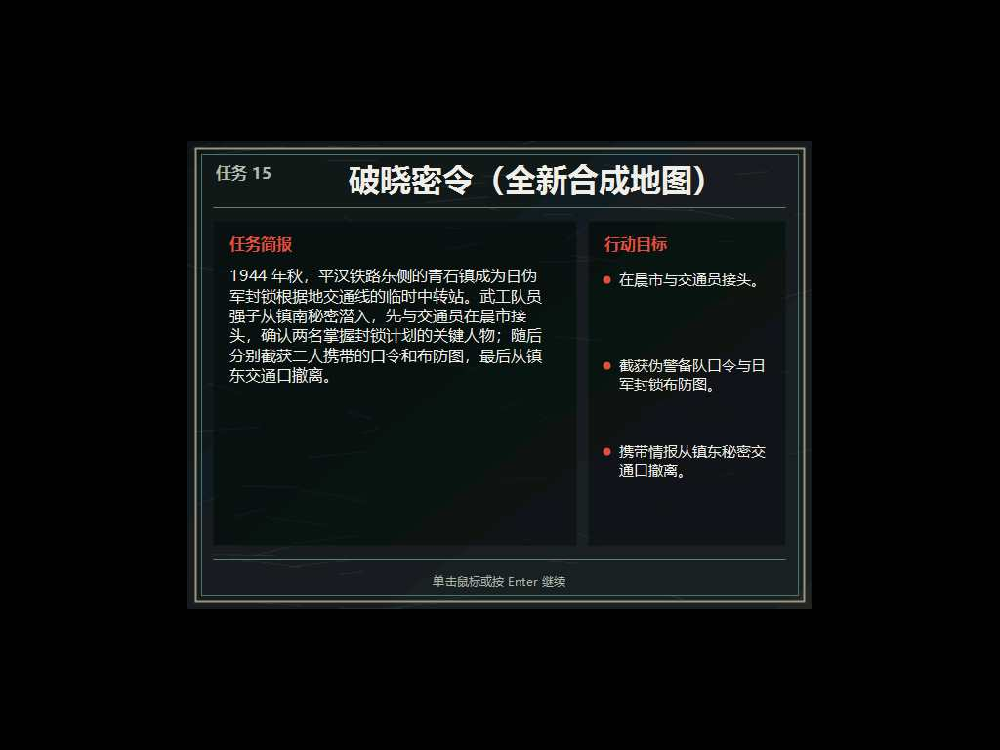

# 原流程文字任务简报与扩展关卡修复报告（2026-07-28）

## 最终结果

任务简报不再使用独立 Win32 弹窗。十五关全部保留原游戏原有流程：

> 原版菜单 → 新游戏 → 原版任务简报画面 → 单击鼠标或按 Enter →
> 载入地图

变化仅发生在原版任务简报画面内部：原图片资源改为由 UTF-8 文案预先绘制的
640×480 文字排版图。原游戏仍负责载入、显示和确认，玩家不会看到第二个
窗口，也不需要学习新的操作。

第 13—15 关已重新完成地图结构、出生安全、相机、可达性、窗口响应和 AI
负载回归。第 15 关此前“画面能看到人物，但点击后人物不转向也不移动”的
根因是渲染相机与鼠标命中换算相机不同步，现已修复。



## 一、文字简报的实现

文案的单一来源为 `Mod/关卡名称.json`。资源工具执行以下转换：

1. 校验第 1—15 关均有标题、正文和三项目标；
2. 使用系统中文字体绘制 640×480 预览；
3. 转换为原引擎使用的 RGB565；
4. 使用 LZO1X 压缩并封装为合法 IBLOCK；
5. 第 1—12 关原位替换 `Intro_000.psd`—`Intro_011.psd` 的载荷；
6. 第 13—15 关写入独立的 `Brief_012.psd`—`Brief_014.psd`；
7. 同步重建 `1937Resources.GFL` 和 `InterMedia.GFL`，保持已有数字索引
   顺序不变。

最终资源共 1,397 项，即原来的 1,394 项加三个扩展关简报。原版十二关不是
清空旧图再另开窗口，而是在原索引直接换成文字图。当前资源哈希：

```text
1937Resources.GFL
C5C785E926E300D779E8DFB6EEB4B26FA4597011B4D425347907DD56753D9158

InterMedia.GFL
7A3997EA205C40D536AE6ADB4843BA2F97283B66A7D1341FC06E3EB708915FFE
```

与原 110,640,932 字节资源归档相比，当前归档为 106,641,023 字节；在增加
三张扩展关简报后仍减少 3,999,909 字节。

### 更新文案

修改 `Mod/关卡名称.json` 后，在仓库根目录运行：

```powershell
powershell.exe -NoProfile -ExecutionPolicy Bypass `
  -File .\Patch\tools\Update-TextBriefings.ps1 `
  -RepositoryRoot (Get-Location)
```

脚本只在 `E:\1937` 创建临时目录。它先编译资源工具、生成并完整校验两份
GFL，再把结果复制到目标卷并成对替换；中途失败会恢复备份。十五张 PNG
预览默认输出到 `E:\1937\text-briefing-previews`。连续重建所得两份 GFL
哈希完全一致，证明生成是确定性的。

## 二、第 15 关点击失效的根因

旧引擎把相机位置保存了多份：

- `CameraX` / `CameraY` 全局值供渲染路径使用；
- 视口控制器的 `+0x30/+0x34` 保存当前画面左上角；
- 视口控制器的 `+0x44/+0x48` 供鼠标命中和世界坐标换算使用；
- `+0x38/+0x3C` 保存相机右下角。

旧修复只把全局值移动到玩家出生点，画面因此看似正确，但点击仍按脚本设置的
旧相机 `(176, 0)` 计算。第 15 关玩家实际位于 `(144, 3016)`，点击坐标会
被换算到地图另一端，所以不会产生玩家预期的寻路目标或朝向。

现在补丁在原游戏线程内一次性提交完整相机矩形，并以控制器内真实
1024×708 游戏视口和 3840×3200 世界边界进行夹取。第 15 关最终相机为
`(0, 2492)`，渲染、命中换算和卷屏起点完全一致；补丁没有调用
`SetCursorPos`、`ClipCursor`、`SendInput` 或全局前台切换 API。

## 三、扩展关地图修复

关卡生成器新增并强制执行以下门禁：

- 起始视口以玩家出生点为中心写入 VWF；
- 玩家出生格必须可通行；
- 出生点到每个任务对象必须存在八方向 A* 路径；
- 每关必须定义一个空闲、可达、处于起始视口内的自动移动探针；
- 敌方初始部署和全部巡逻点必须满足出生安全距离；
- 巡逻首点若与对象当前位置重合，会循环平移路线，避免旧引擎在开局处理
  零长度路径；
- 每段巡逻路径必须低于关卡定义的 A* 上限。

当前结果：

| 关卡 | 玩家出生 | 移动探针 | 最近初始敌人 | 最近敌巡逻点 | 可达通行格 |
|---|---:|---:|---:|---:|---:|
| 13 余烬行动 | `(1,198)` | `(5,194)` | 877 | 877 | 99.41% |
| 14 锄奸行动 | `(1,114)` | `(5,110)` | 800 | 608 | 99.80% |
| 15 破晓密令 | `(4,188)` | `(8,184)` | 923 | 1000 | 98.94% |

第 15 关两条含 42/23 个固定槽位的旧巡逻记录已改为短距离循环，所有相邻
段均非零且可达，不再开局进行跨全图重复路径计算。

## 四、运行验证

验证在 `E:\1937` 的隔离游戏副本进行，只向被测游戏窗口和进程内
DirectInput 代理投递消息，不移动、裁剪或锁定系统鼠标，也不抢占系统焦点。

原版第 1 关以及扩展第 13—15 关均单独完成任务简报实机检查：简报位于原
游戏主窗口、世界对象尚未载入、没有外部对话框，画面有效且仍由原来的单击
或 Enter 操作继续。第 1 关实机截图 SHA-256 为
`B5E6509F4DBF29D87F99707374D2B84B756744F6ADA3B7F2F52F70A09B0F68CE`，
由此同时覆盖原位替换资源和扩展追加资源两条显示路径。

| 关卡 | 活动对象 | 初始相机 | 出生 5 秒 | 单核 CPU | P95/P99 | 未响应 | 光标裁剪 |
|---|---:|---:|---:|---:|---:|---:|---:|
| 13 | 101 | `(0,2492)` | 存活 | 4.64% | 8.06/11.03 ms | 0 | 0 |
| 14 | 75 | `(0,1478)` | 存活 | 3.91% | 8.03/11.68 ms | 0 | 0 |
| 15 | 75 | `(0,2492)` | 存活 | 5.35% | 8.10/9.57 ms | 0 | 0 |

三关均验证：

- 路由和对应 VWF 正确；
- 没有外部任务简报窗口；
- 玩家在起始视口内；
- 渲染相机与两份点击换算相机完全一致；
- 目标格为空闲、处于视口内且从出生点 A* 可达；
- 窗口内选择、移动目标坐标及两个原版鼠标按钮均成功送达；
- 出生阶段玩家未死亡；
- 有界警报最多召集三名敌人，搜索后 9/9 正常脱离；
- 全程没有窗口未响应或系统光标限制。

第 15 关另完成 60 秒大地图性能基线：971 个采样，单逻辑核 CPU 7.01%，
合成等待 P95/P99 为 8.224/9.264ms，超过 25ms/50ms 的卡顿均为 0，
未响应为 0，稳态磁盘读取峰值为 0，遥测队列无丢弃。首次资源读取被正确
分类为 `first_resource_load`，没有演变成持续微卡。

后台窗口不会获得真实系统前台资格，因此自动验证只断言原版输入数据和命中
坐标已送达，不伪造玩家目标或直接写入玩家行动结构。玩家真正前台操作仍走
原版选择、寻路、转向和动画状态机；本次修复只消除了此前使该状态机收到错误
世界坐标的相机分裂。

## 五、防回归入口

```powershell
# 编译补丁
.\Patch\tools\Build-Mod.ps1

# 第 13—15 关隔离运行回归
.\Patch\analysis\tools\Test-ModRegression.ps1 `
  -LevelList 13,14,15 `
  -DurationSeconds 40 `
  -OutputRoot E:\1937\mod-regression-extension

# 资源格式、SDK、代理安全和地图门禁
.\Remake\tools\Verify.ps1 -GodotExecutable D:\Godot\Godot.exe
```

源代码门禁会拒绝全局鼠标/焦点 API，并检查独立简报窗口代码不参与编译；
资源测试覆盖 LZO1X 编码、IBLOCK 往返、GFL 原位替换、扩展资源追加和索引
保持。
