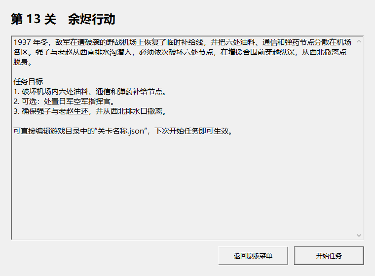
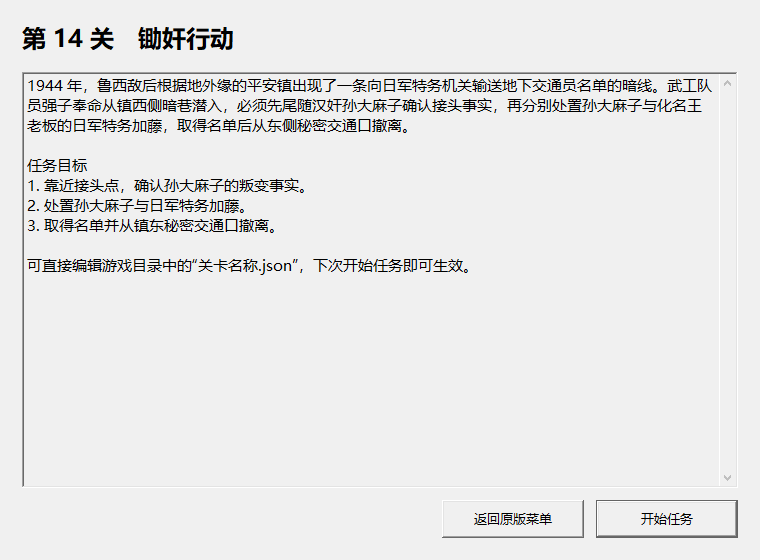

# 扩展关卡与文字简报修复报告（2026-07-27）

> 历史说明：本文件记录 2026-07-27 的中间方案，其中“独立文字窗口”和
> “清空旧简报载荷”已于 2026-07-28 被撤销。最终方案保留原游戏任务简报
> 画面，把文字预先绘制进原版 GFL 图片资源。本文 m014 的完整区块重排、
> 哈希和性能结论也已被后续“真实移动”回归推翻；正式版本改为拓扑安全
> 地表合成。请以
> [原流程文字任务简报与扩展关卡修复报告-20260728.md](原流程文字任务简报与扩展关卡修复报告-20260728.md)
> 为准。

## 结论

- `1937m014.vwf` 的严重卡顿已经消除。最终文件在原版引擎中进入任务、
  加载 75 个运行时活动对象，全程未出现“未响应”；稳态单逻辑核占用由
  约 42.5% 降至约 9%。
- 120×200 地图的合法相机范围为 X=0—3044、Y=0—2589，四个边界均已
  在隔离进程内访问，证明整张地图不是只有出生区可见。
- 第 13 关“余烬行动”和第 14 关“锄奸行动”不再显示被复用关卡的标题与
  图片简报。根据后续决定，全部 15 关都在原游戏进程内显示文字简报。
- 自动验证不移动、裁剪或锁定系统鼠标，不调用全局前台切换；所有输入和
  相机边界验证只作用于测试副本的进程内状态。

## 一、`m014` 卡顿根因与修复

合成地图本身不是瓶颈。三组同配置对照结果如下：

| 样本 | 单逻辑核占用 | 结论 |
|---|---:|---|
| 原版 m006 地图 | 约 7.9% | 引擎基准正常 |
| 仅完成八区合成、未部署新任务 | 约 8.9% | 地形、五层和 1,470 个 scene 不是卡顿来源 |
| 旧版 m014 最终任务 | 约 42.5% | 新任务部署引入瓶颈 |
| 修复后的 m014 最终任务 | 9.2% | 恢复到正常范围 |

旧任务让 scene 1457 和 1460 分别沿 42/23 个点横跨全图巡逻，个别相邻
路点的实际 A* 路径达到 208 步。原版引擎在单线程主循环中持续为活动对象
更新长路径，因此静态 A* 检查虽然通过，运行时却会占满大量主线程时间。

修复保持两个 scene 原有的 42/23 个序列槽位和二进制记录长度不变，只把
路线改为目标区域附近的短循环，最长单段降为 9 步。生成器新增
`maximum_patrol_segment_path_length` 门禁；m014 的上限为 64 步，今后
任何超预算巡逻都会在生成 VWF 前失败。

最终文件：

- 路径：`Mod/1937m014.vwf`
- 长度：1,227,424 字节
- SHA-256：
  `412468E20B40BCBD4A71089F11A7BF5A29EDFC8F34E8EFE1C94EE0D6CBA4B23D`
- 出生点可达通行格：14,298/14,451（98.94%）
- 任务目标与全部巡逻段：八方向 A* 通过
- 56 秒原版引擎回归：CPU 9.2%、未响应 0、稳态磁盘读取 0
- 完整相机跨度：3044×2589，与 VWF 世界尺寸和 796×611 视口计算结果一致
- 发行性能门禁 60 秒：CPU 8.862%、P95/P99 16.786/17.444ms、
  超过 25/50ms 卡顿 0/0、光标裁剪限制 0，结果通过
- 第 13—15 关十阶段回归：30/30 阶段通过，CPU 6.27—15.36%，P99
  17.682—18.049ms，未响应与光标裁剪限制均为 0；AI 脱离 9/9 成功

## 二、15 关统一文字简报

玩家在原版主菜单点击“新游戏”后、地图载入前，游戏进程内的原生窗口会
显示：

1. 正确的关卡序号和名称；
2. 可换行的文字背景与任务说明；
3. 三项清晰的任务目标；
4. “返回原版菜单”和“开始任务”两个入口。

这不是 `选择关卡.ps1` 的前置预览框。选择器只传入关卡号；原版“新游戏”
命令真正发生时，代理才显示文字。玩家确认后，补丁设置原版简报循环自己的
确认标志，因此旧图片不会出现，也不依赖模拟鼠标点击。第 1、13、14、15
关分别完成了真实原版进图抽样：

| 关卡 | 引擎任务 | 已加载活动对象 | 未响应 |
|---|---:|---:|---:|
| 营救行动 | 1 | 127 | 0 |
| 余烬行动 | 12 | 101 | 0 |
| 锄奸行动 | 7 | 75 | 0 |
| 破晓密令 | 7 | 75 | 0 |

15 条路由均检查标题、正文和三项目标非空。进程内窗口使用 User32/GDI
控件，不依赖 .NET 或公共控件 v6；自动验证以 `SW_SHOWNOACTIVATE`
显示并用 `PrintWindow` 只截取该窗口，不抢焦点、不读取整张桌面。





原版十二张图片位于 GFL 索引 1048—1059。最终 `Mod` 保留这十二个条目、
名称、属性以及后续所有固定索引，只把已不再读取的图片载荷清空，并同步重写
`InterMedia.GFL` 的长度和偏移：

- 清除载荷：5,461,822 字节（5.209 MiB）；
- 资源条目总数：仍为 1,394；
- `1937Resources.GFL`：110,640,932 → 105,179,110 字节；
- 精简后 SHA-256：
  `A7F1A560B81F04161A1B047AD3978F805A8981A527692C75AF554311643441AF`；
- `InterMedia.GFL` SHA-256：
  `55CB3DF2852914E44E4D91FC3EFBE3640CB5137909D5CC817436CFA0D5FD4829`。

第 1、12 关在精简归档上完成首尾图片索引的原版引擎进图验证。资源工具还
提供 `strip-briefings` 命令及不读取原游戏数据的合成测试，防止索引错位。

## 三、如何修改简报

普通 MOD 使用者可直接编辑：

```text
Mod/关卡名称.json
```

每个 `missions` 元素的可编辑字段为 `title`、`briefing`、`objectives`；
`replace_legacy_briefing` 保持为 `true`。代理在每次开始任务时直接读取这
个 UTF-8 文件，保存后下次开始任务立即生效，不需要重新编译。若文件缺失、
损坏或当前关数据不完整，会安全回退到 DLL 内置文案。

开发者应修改唯一源：

```text
SDK/mission-routes.json
```

然后重新生成并编译：

```powershell
.\SDK\tools\Generate-SdkArtifacts.ps1
.\Patch\tools\Build-Mod.ps1
```

生成器会把同一份路由和文案同步到 SDK 代码与启动中心目录，避免源码、
选择器和可玩 `Mod` 再次版本脱节。

## 四、复现验证

```powershell
# 15 个文字简报的数据、正文非空和光标安全
.\Patch\analysis\tools\Test-LauncherConfiguration.ps1 `
  -OutputRoot E:\1937\launcher-all-briefings

# 生成保留固定索引的无图片 GFL 对
dotnet run --project .\Remake\tools\ResourceTool -c Release -- `
  strip-briefings .\原版\1937Resources.GFL .\原版\InterMedia.GFL `
  .\输出\1937Resources.GFL .\输出\InterMedia.GFL

# m014 确定性重建和巡逻预算
.\MapEditor\Missions\m014\Build-Mission.ps1 `
  -WorkDirectory E:\1937\m014-rebuild `
  -SkipPreview

# MOD 代理和启动中心成品
.\Patch\tools\Build-Mod.ps1
```

本地原版引擎证据保存在 `E:\1937` 的隔离测试目录；仓库只保存小型结论和
压缩后的单窗口截图，不提交运行时存档、完整桌面截图或临时副本。
