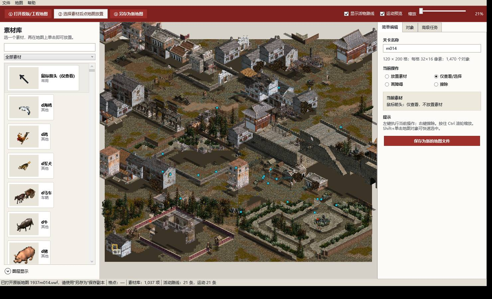

# 第十五关：破晓密令

## 故事

1944 年秋，平汉铁路东侧的青石镇成为日伪军封锁根据地交通线的临时
中转站。敌人准备在天亮后同时搜查三条地下交通线，两名掌握口令和布防图
的关键人物已进入镇内。

武工队员强子从镇南秘密潜入，必须先在晨市与交通员接头，确认情报和目标
身份；随后在巡逻网收紧前分别截获伪警备队联络官与日军封锁顾问携带的
材料，最后从镇东秘密交通口撤离。

## 任务闭环

1. 从西南安全巷口潜入；
2. 到达晨市 scene 1461，确认任务目标；
3. 处置沿全镇长路线活动的 scene 1457；
4. 处置在中部街区反复转移的 scene 1460；
5. 到达镇东 scene 1462 撤离。

第 15 关在原引擎内部复用第 7 关已经验证的任务状态机，只在本次进程中
把等长文件名 `1937M006.VWF` 重定向为 `1937M014.VWF`。因此任务条件仍
由原版代码执行，并不依赖外部脚本“假装通关”。

## 为什么这次算新地图

此前第 13、14 关都保留了一张完整原版底图，只重新部署人物和路线。第 15
关改用区块蓝图合成：

- 把 m006 的 120×200 世界切成 8 个完整城区，并让 8/8 全部换位；
- 同步换位地表、视线障碍、移动障碍、事件和人工修正五个图层；
- 同步改写 1,470/1,470 个 scene 的世界/参考坐标以及原巡逻数组；
- 再独立重做玩家、两个任务目标、任务点、出口和 32 个敌方对象；
- 原位置地表有 21,317/24,000 格发生变化，即 88.82%；
- 新旧地表 SHA-256 指纹不同。

这仍然复用原游戏的房屋、院墙、道路、树林等美术资源——这正是 MOD 应有
的资源复用；复用的是“积木”，不是完整地图布局。

## 自动验证

- 玩家出生：`(4,188)`；
- 最近敌军初始位置：923 世界单位，硬阈值 800；
- 最近敌军巡逻点：1,000 世界单位，硬阈值 800；
- 从出生点可达 14,298/14,451 个通行格（98.94%），高于蓝图 95% 硬阈值；
- 出生点到接头、双目标和出口的 A* 长度分别为 24、264、199、113；
- 关键目标与全部重编敌军巡逻段均通过八方向 A*；
- 输出 VWF 为 120×200、1,470 scene，结构与任务骨架等价；
- 40 秒原版引擎探针确认 `1937M014.VWF` 已加载、任务号为 7、窗口持续响应。

完整数字见
[`MapEditor/Missions/m014/composition.md`](../MapEditor/Missions/m014/composition.md)、
[`MapEditor/Missions/m014/validation.md`](../MapEditor/Missions/m014/validation.md)
和
[`Patch/analysis/results/extension-level15-runtime-probe-20260727.txt`](../Patch/analysis/results/extension-level15-runtime-probe-20260727.txt)。

## 进入方式

在 `Mod` 目录右键运行 `选择关卡.ps1`，选择
“第 15 关 破晓密令（全新合成地图）”，再从原版菜单点击“开始游戏”。

